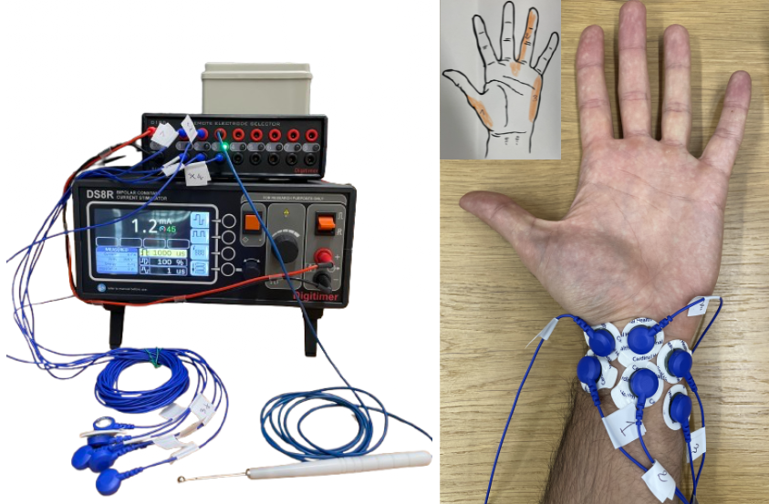
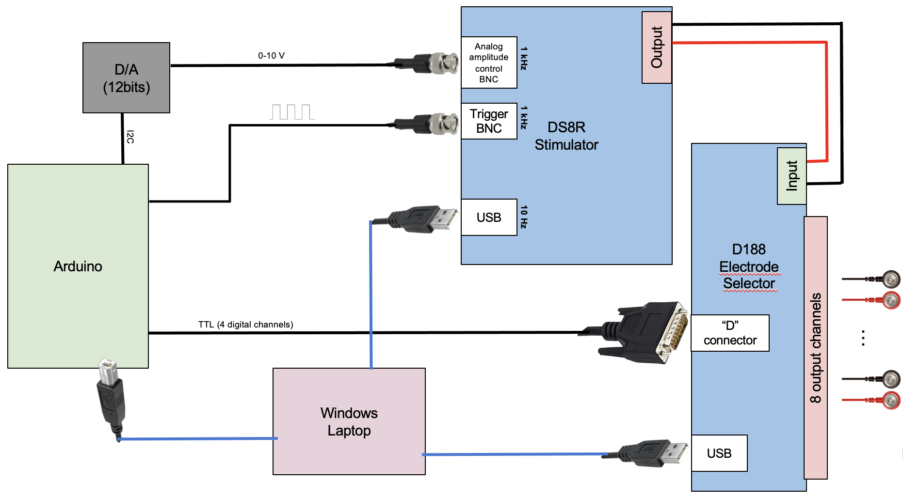
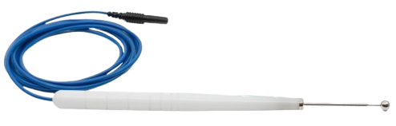
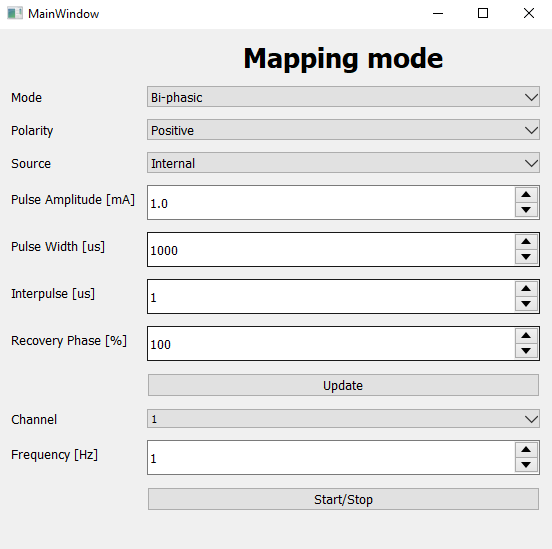
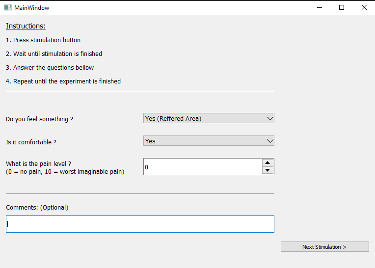

# TTENS controll software for multielectrode psychophysics experiments

### About The Project
This project is a Python-based framework for conducting psychophysics experiments using the stimulation device [DS8R][DS8R-url] and the electrode selctor [D188][D188-url] from Digitimer. It allows for control of stimulation parameters (preset or dynamically), channel switching and automated data logging and plotting. The software integrates APIs for device communication and offers flexible workflows for  psychophysics experiments.



## Requirements
* __Operating System__: windows 7 or higher
* __Python version__: 3.11.9
* __PyQt version__: 5.15.9 (__Qt version__: 5.15.2)
* __DS8R DLL__: D128API.DLL 
* __D188 DLL__: DGD188API.DLL

__Note:__ Be carefull this code uses the original DLL and not the proxy DLL provided by Digitimer! Both DLLs are downloaded automatically with the windows app provided on each device webpage.


## Experiment Setup
The Digitimer DS8R current stimulator and D188 electrode selector where used in the following configuration with an arduino 101 board and a Gravity: 2-Channel I2C DAC Module. More details regarding the hardware can be found in the report.


## Mapping (Script0)
Mapping consist in finding the areas in the wrist, elbow or amputee's residual limb that provoke a distal percept in the (phantom) hand. This is possible by stimulating the peripheral nerves, mainly the median and ulnar nerves. The location of the electrode will influence the strength and quality of the referred sensation

### Lessons learnt
During mapping it was found practical to use one normal electrode that will be fixed in a chosen position, plus the MYO stimulation pen with ball tip purchased specifically for mapping. Before starting to put the electrodes, it's worth keeping in mind that the space on the wrist is limited and with surface adhisive electrodes that are > 10mm it gets packed very quickly. The two electrodes should be approximitally withing a 5cm range from each other. If they are too far, the resistance is too high, the charges might get dispersed more and the distal percepts are worse. The pen is convinient to explore the surface of the skin, however the sensation with the pen and with the electrodes will be different. This is due to several reasons, like the difference of the contact pen/skin and electrode/skin as well as the fact that the person doing the mapping will try to push the pen into the skin to reach the desired sensation with is not possible with the electrodes.



### User Steps
1. Connect the hardware as shown in the figure above
2. Make sure the microcontroller has the proper program installed (TENS_controller.ino)
3. Set the "Current Amplitude Lock" to a safe maximum value. This can be done by manually setting a current amplitude on the DS8R then pressing the dial for a few seconds. For more details about this step consult the datasheet.
4. Launch script0_mapping.py and make sure in the terminal to get a success message for the communication with the microcontroller and the the other instruments. The window shown below should open. The values on the DS8R as well as the ON channel should update to match the ones in the GUI.

5. You can connect the electrodes and the pen and starting the mapping step. To change the values on the DS8R the update button should be changed. The channels switch directly if it's changed in the GUI. After the desired trigger frequency is set, the Start/Stop button can be pressed to start or stop the stimulation.

## Calibration / Psychophysics experiments
The calibration step consists in tuning the stimulation parameters for each stimulation location to understand and improve the evoked sensation. The most commonly performed experiment is to generate a psychofunction for detecting the minimum threshold. These experiments are useful to understand TENS capability in tactile sensory feedback. 

In the context of this semester project, two pilot experiments were performed for minimum threshold and maximum threshold detection using a staircase methode. The experiment platform however can be adapted to create new personalized experiments. More information about psychophysics can be found in the report.

### Experiment Window
This Window below is used for all experiments, but the questions and the finite state machine (FSM) of the experiment can be changed. It allows the user to trigger a stimulation sequence, during which a green LED and a message will apear asking him to wait for the stimulation to happen. Then he will be able to enter his response. The way the current FSM works is that the user input is saved after he clicks to start the next stimulation.



### Script 1 - Minimun Threshold Detection
This step assumes that mapping has been done before and the electrodes have been placed. 

1. Open script1_min_detectin_threshold.py and go down to the main section to enter the subject and experiment parameters:
```py
    subject_info = {
        'subject_reference': 'Habib', # to be replaced by an anonynous reference
        'gender': 'Habib',
        'age': None,
        'hand_side': 'left'
    }
    fixed_param = {
        'polarity': 'Negative', 
        'mode': 'Bi-phasic',
        'source': 'Internal',
        'pulsewidth': 50,
        'dwell': 50,
        'recovery': 75,
        'frequency': 15,
    }
    algo_settings = {
        'stimuDuration[ms]': 1000,
        'numTriggers': 0,
        'numRepetition':None,
        'channels': [2,3], # set connected channels
        'nbInversionPoints': 10
    } 
    variable_param = {
        'variable': 'demand',
        'start': 6.0,
        'stop': 19.0,
        'step': 0.5
    }

    # Start app
    app = QApplication(sys.argv)
    window = Experiment_view(fixed_param, algo_settings, variable_param, subject_info)
    window.show()
    app.exec_()
```
2. Run the script1 and the experiment should launch automatically. 

### Script 2 - Maximum Threshold Detection
The script2_max_detection_threshold.py works identically to the minimum detection threshold. The FSM of the experiment is what changes.

### About the code
First, the GUI is designed using PyQt. This is a very easy and powerful library to build desktop applications. Except some specific features, the front end code was not written manually but generated using QtDesigner. You can launch the Designer window with the following command in the terminal:
```sh
qt5-tools designer
```
This generates the .ui files in the QtDesigner folder.

The experiment scripts have two classes, Experiment_view and Worker. Worker executes the actions when a stimulation is started on a different thread. This is necessary to avoid the experiment window freezing since the stimulation sequence take a few seconds. Experiment_view contains all the rest. 

min_threshold_detection() and max_threshold detection() define the FSM of the experiment.

When an experiment is launched, a csv file is automatically created in the recorded_data folder startign with date and time. After each stimulation the data is added to the file so even if the experiment is interupted the data will be saved.

<!-- MARKDOWN LINKS & IMAGES -->
[DS8R-url]: https://www.digitimer.com/product/human-neurophysiology/peripheral-stimulators/ds8r-biphasic-constant-current-stimulator/
[D188-url]: https://www.digitimer.com/product/human-neurophysiology/stimulator-accessories/d188-remote-electrode-selector/d188-remote-electrode-selector/